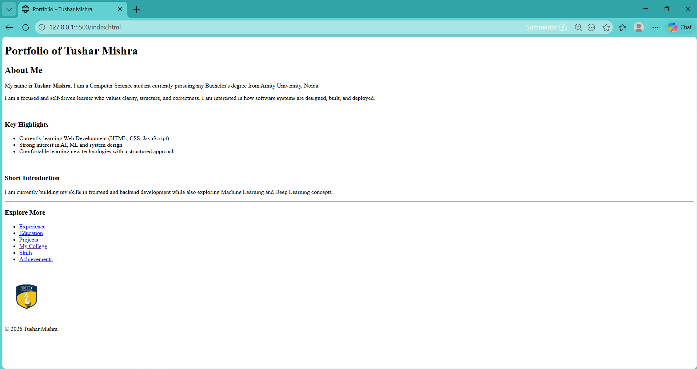
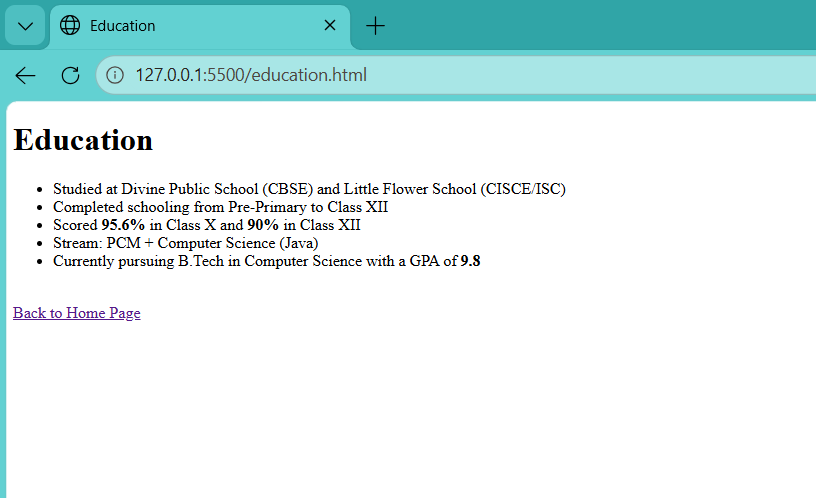
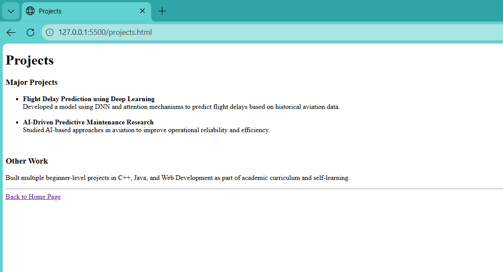
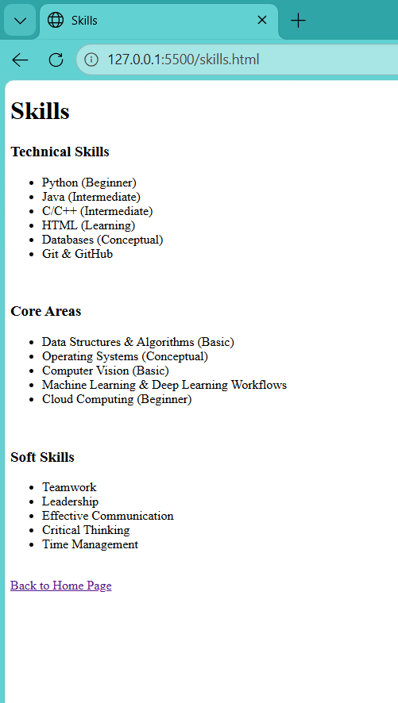
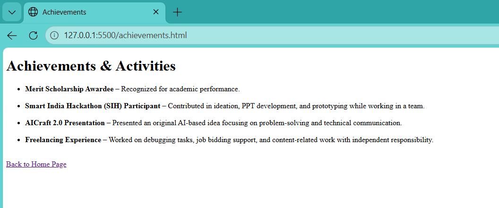

#  Personal Portfolio (HTML)

🔗 **Live Site:**  
https://tusharr-mishra.github.io/portfolio-html/

---

## About The Project

This is a beginner-friendly **multi-page personal portfolio website** built using pure HTML.  
It showcases my education, skills, projects, and experience in a structured format.

This project reflects my foundational understanding of web development and will be enhanced with CSS, responsiveness, and modern UI in future updates.

---

##  Tech Stack

---

##  Features

-  Multi-page website structure
-  Sections for education, skills, projects, and experience
-  Simple navigation between pages
-  Clean and beginner-friendly code

---

##  Screenshots

###  Home Page

###  Education Page

###  Projects Page

###  Skills Page

###  Achievements Page

---

##  Future Improvements

-  Add CSS styling
-  Make website responsive
-  Improve UI/UX design
-  Add dark mode (optional)

---

##  Project Structure

portfolio-html/
├── index.html
├── education.html
├── experience.html
├── projects.html
├── skills.html
└── screenshots/

---

##  Author

**Tushar Mishra**

---

⭐ If you like this project, consider giving it a star!
