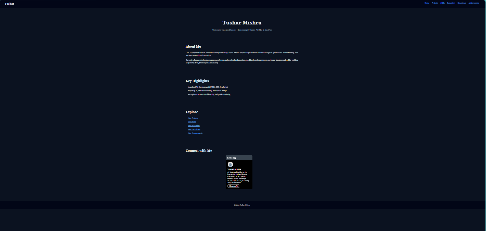

# Personal Portfolio (HTML + CSS)

🔗 **Live Site:**  
https://tusharr-mishra.github.io/portfolio-html/

---

## About The Project

This is a beginner-friendly **multi-page personal portfolio website** built using HTML and later enhanced with CSS.  
It showcases my education, skills, projects, and experience in a structured format.

The project was initially created using only HTML to understand structure and page navigation.  
It was later improved using CSS to enhance layout, spacing, and overall visual design.

---

## Tech Stack

---

## Features

• Multi-page website structure  
• Sections for education, skills, projects, and experience  
• Navigation across pages  
• Improved layout using CSS (spacing, colors, typography)  
• Project cards and structured sections  
• Integrated external components (LinkedIn profile badge) 

---

## Screenshots

### Before (HTML Only)
📂 assets/images/before/

### After (HTML + CSS)
📂 assets/images/after/

---

## What I Learned

- Structuring multi-page websites using HTML  
- Using semantic tags for better organization  
- Styling layouts using CSS (Flexbox & Grid)  
- Managing spacing, alignment, and readability  
- Improving UI without using frameworks  

---

## Future Improvements

- Improve responsiveness for mobile devices  
- Add project links (GitHub) inside cards  
- Enhance UI with better spacing and alignment  

---

## Project Structure

portfolio-html/  
├── index.html  
├── education.html  
├── experience.html  
├── projects.html  
├── skills.html  
├── achievements.html  
├── css/style.css  
└── assets/images/  

---

## Author

**Tushar Mishra**

---

⭐ If you like this project, consider giving it a star!
